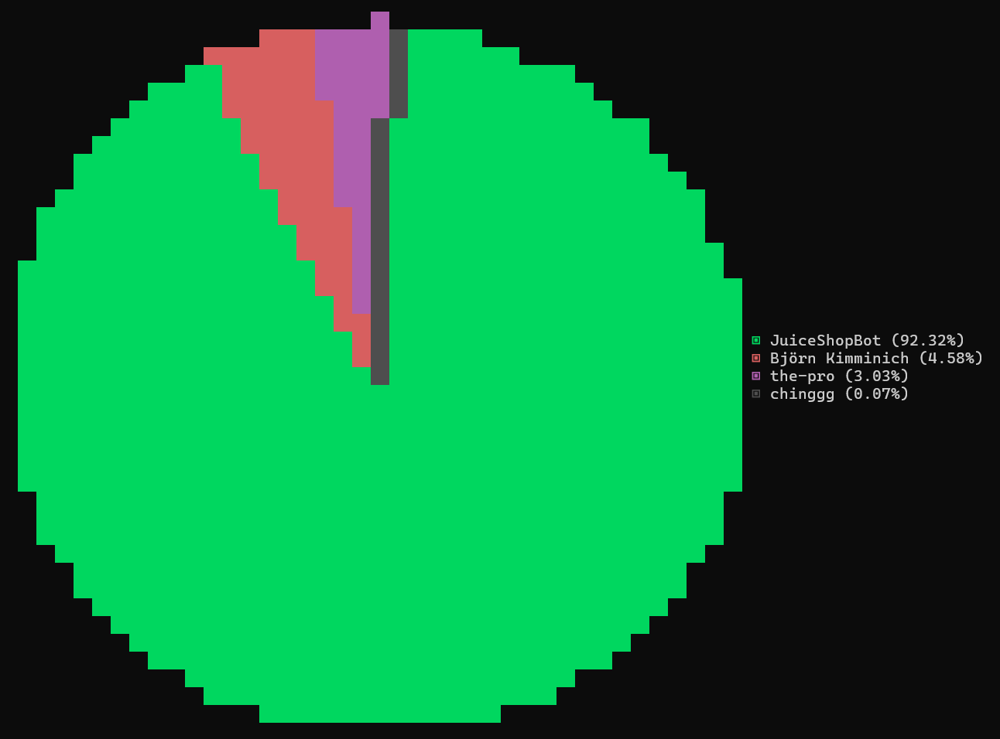

# OWASP Juice Shop Statistics

<https://stats.owasp-juice.shop/>

## GitHub Contributors

As reported by [`git-stats -a -s '2021'`](https://www.npmjs.com/package/git-stats) analysis
of `master` as of Wed, 13 Oct 2021 after deduplication with `.mailmap`.

## Stargazers (over time)

## Licensing

This program is free software: you can redistribute it and/or modify it
under the terms of the [MIT license](LICENSE). OWASP Juice Shop
Statistics and any contributions are Copyright © by Bjoern Kimminich &
the OWASP Juice Shop contributors 2021-2022.
